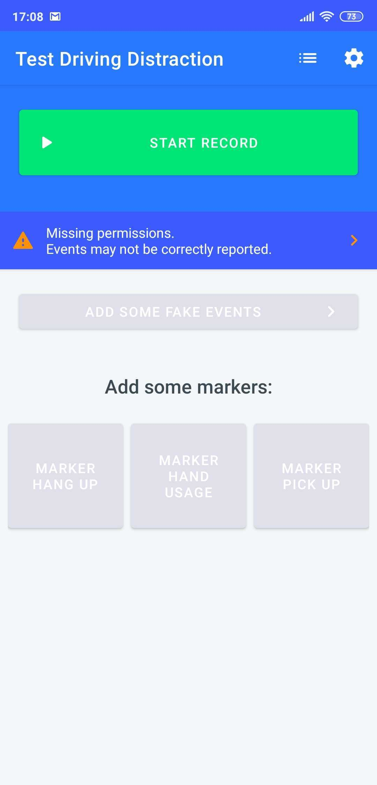
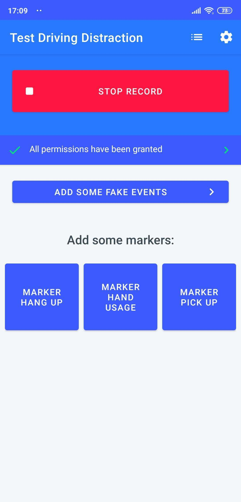
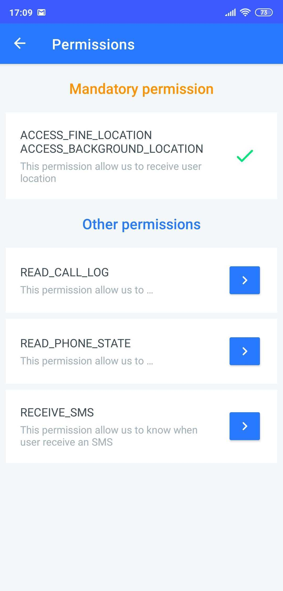
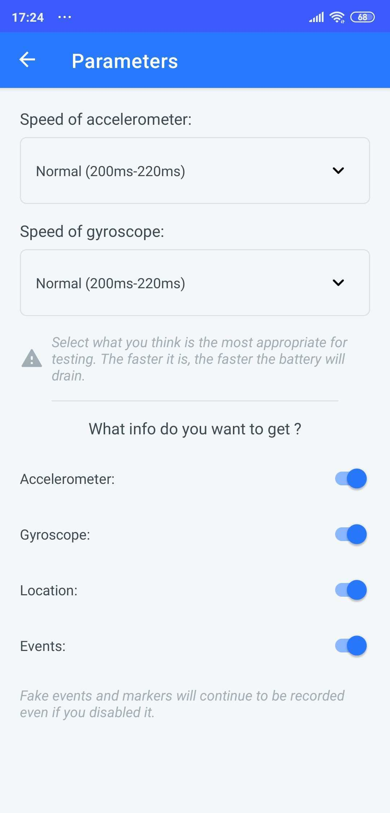
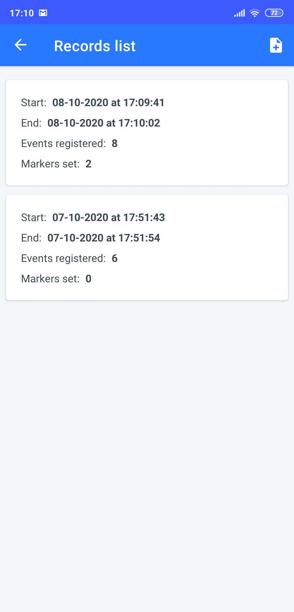
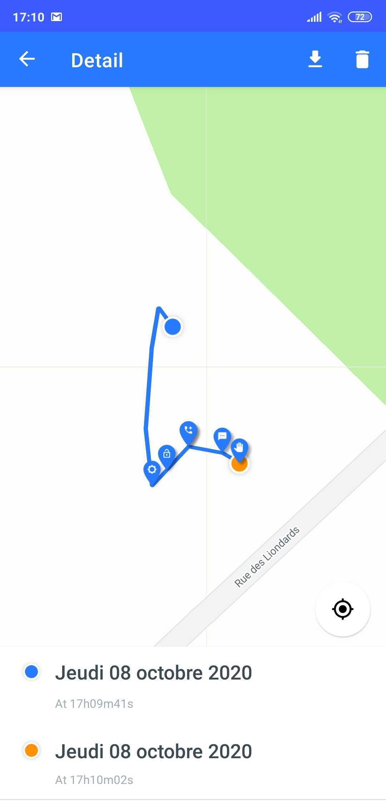
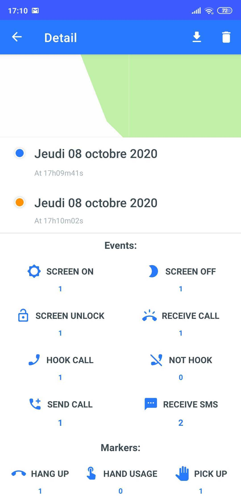

# Driving Event Detection

1. Retreive info:
    - Location
    - Accelerometer localised
    - Gyroscope localised
    - Events (Screen ON/OFF, UNLOCK, Call received/hooked/not hooked/sent, SMS Received, USB plugged)

2. Import and export data to .json format

3. Captures:

Home Not Recording

Home Recording

Permissions

Settings

List

Detail

Detail With Info

